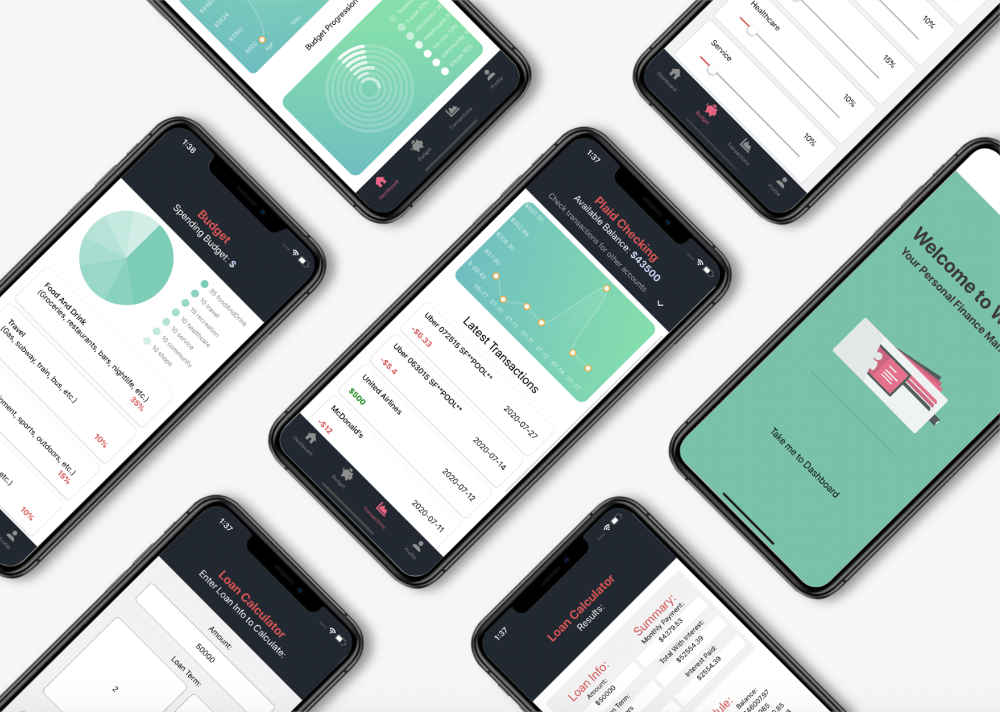
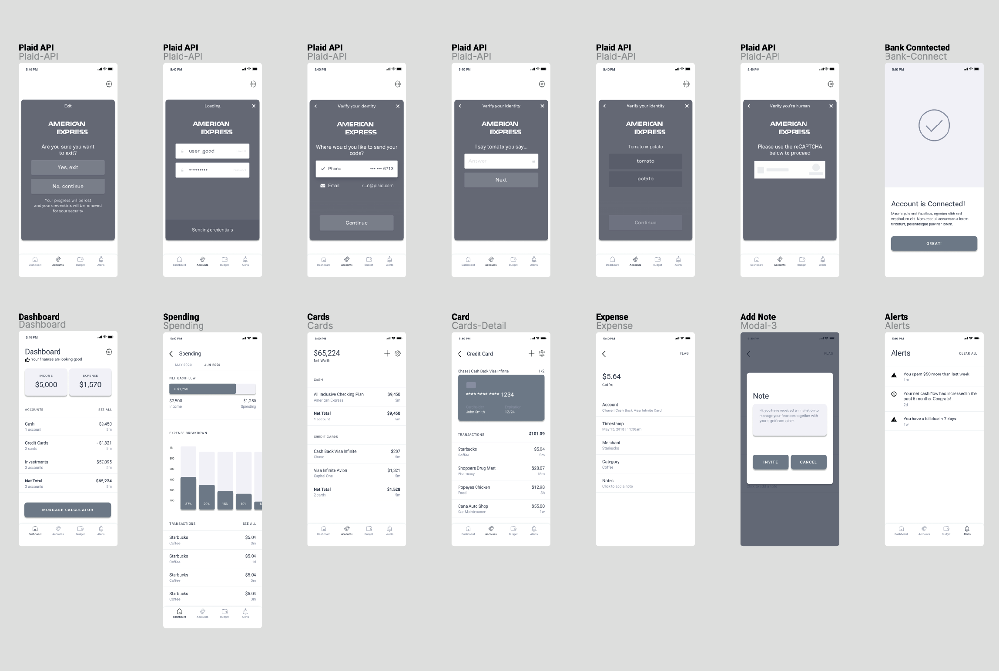
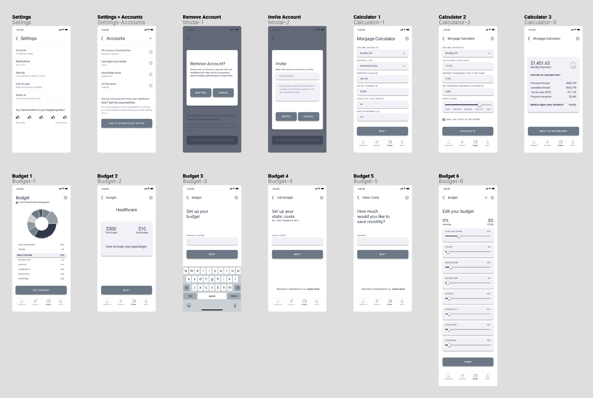

## Wallet Finance Mananager  
Personalized money managing and financial tracking cross-platform application that encourages better spending habits and budget tracking. It brings together user's bank accounts, credit cards, bills and investments so user can see all the spending, set and manage the budget, and reach financial goals. Plaid API was used in order to connect user's bank accounts - it provides a secure way to store user's transactional data through a multi-factor authentication process. Wallet also provides a loan calculator which calculates the monthly payment, the amount of interest paid, the total cost of credit, and payment schedules.  
Tech Stack: JavaScript, React-Native, Redux, Node, Express, Sequelize ORM, PostgreSQL, Plaid API, ChartsJS

  

## Setup
To run this project, navigate to the directory and run one of the following yarn commands.

- ```cd Finance_Manager```
- ```npm install``` or ```yarn install```
- ```yarn start #``` you can open iOS, Android, or web from here, or run them directly with the commands below.
- ```yarn android``` or ```yarn ios``` or ```yarn web```

## User Interface Wireframes
Used [**Figma**](https://www.figma.com/) (a vector graphics editor and prototyping design tool) to design components, layout application structure and flow, and create high fidelity User Interface wireframes.  




